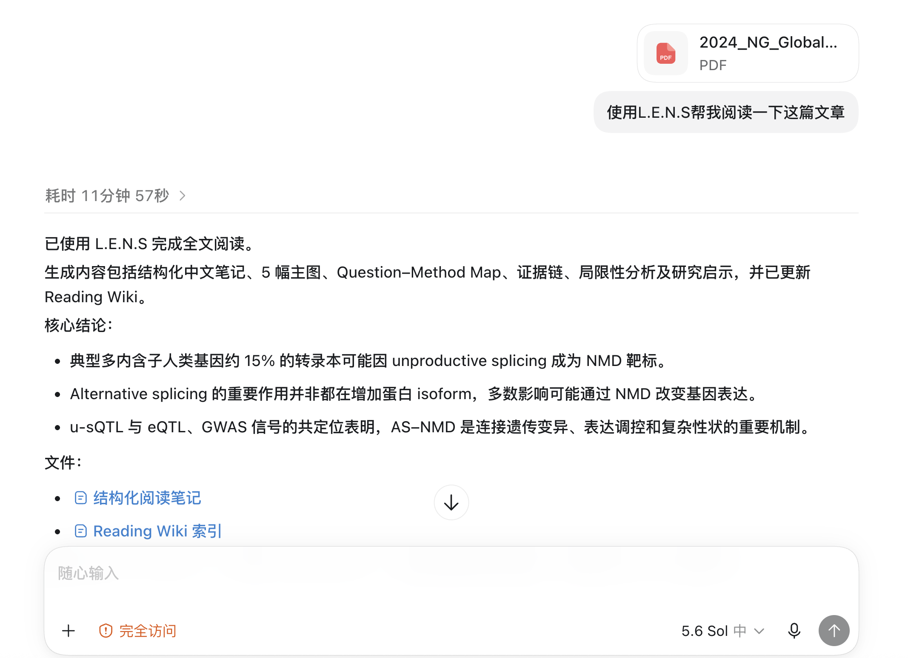
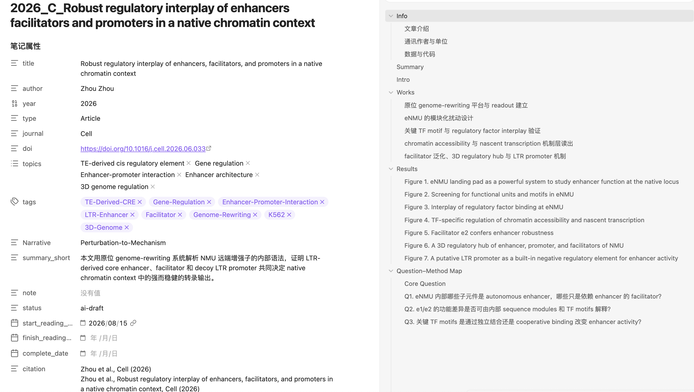

# LENS

**Literature Engine for Note-making and Synthesis**

LENS is a Codex Skill and script-based literature workflow. Give an Agent a scientific paper and LENS can create a structured Chinese Obsidian note, extract numbered figures and Review tables, maintain literature indexes, monitor new publications, and turn a note into a figure-led PowerPoint.

## Documentation

- [中文说明](README_CN.md)
- [English documentation](README_EN.md)
- [Installation](docs/installation.md)
- [Configuration](docs/configuration.md)
- [Workflow](docs/workflow.md)
- [System directories and cleanup](docs/system-directory.md)
- [系统目录与清理说明](docs/system-directory_CN.md)
- [Troubleshooting](docs/troubleshooting.md)

## At a glance

Ask the Agent in natural language:

```text
使用 LENS 读取这个 PDF，生成结构化文献笔记。
```



LENS produces structured, figure-aware notes designed for continued reading and curation in Obsidian.



## Core capabilities

- Article and Review PDF ingestion
- Structured Chinese Obsidian notes with metadata and evidence logic
- Numbered Figure extraction and Review Table extraction
- Question–Method Map, evidence chain, critique, and research implications
- Reading and Library Wiki generation
- RSS/API literature follow-up based on configured research projects
- Figure-led PowerPoint generation from LENS notes

Licensed under the terms in [LICENSE](LICENSE).
